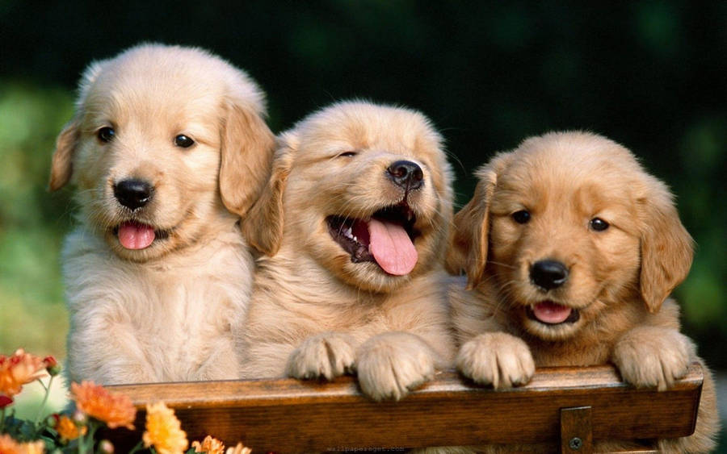
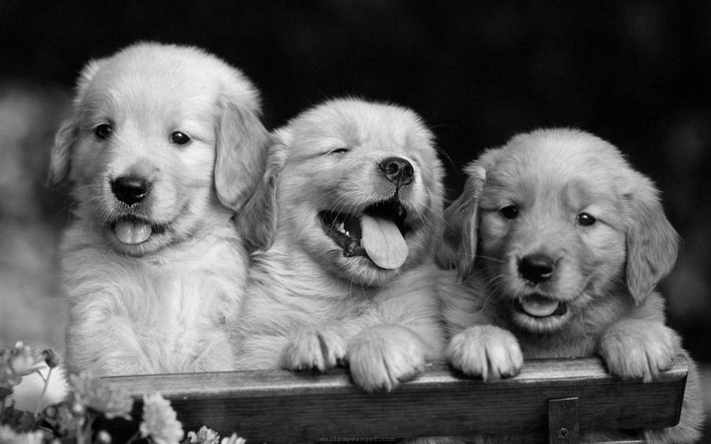

## Introduction
CUDA implementation of `cv::cvtColor`, `cv::COLOR_RGB2GRAY`. Template referenced from Coursera GPU Specialization course with modifications.

## Building & Running
Execute `make` and `./convert_rgb_to_grayscale.exe`.
To specify input and output image: `./convert_rgb_to_grayscale.exe -i dog.jpg -o grey-dog.jpg`.

## Result
Original Image

Output Image
